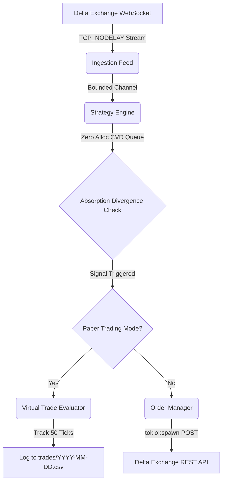

# Delta Exchange Order Flow Trading Engine in Rust

A high-performance, sub-second latency order flow trading engine written in Rust. The engine ingests live market trades via WebSockets, calculates a Cumulative Volume Delta (CVD) passive absorption indicator in a zero-allocation hot path, and manages risk-aware limit orders via Delta Exchange's authenticated REST API.

## Core Features & Optimizations

- **Zero-Allocation Runtime Hot Path**: Uses statically bounded `VecDeque` arrays capped at 500 rows to ensure no heap allocations are performed during trade telemetry ingestion and calculation, keeping CPU cache latency minimal.
- **Asynchronous Decoupled Concurrency**: Ingestion, Strategy, and Execution layers communicate via fast, lock-free bounded `tokio::sync::mpsc` channels.
- **Nagle's Algorithm Disabled (`TCP_NODELAY`)**: The underlying WebSocket TCP stream is configured with `disable_nagle = true`. This forces the network stack to transmit and receive WebSocket frames instantly rather than pooling them into TCP buffers, drastically reducing microsecond latency.
- **Bullish Passive Absorption Divergence Strategy**: Continuously monitors the 50-tick lookback window for instances where the price drops but CVD grows significantly (exceeding $5.5 \times \text{trade size}$), signalling passive buyers absorbing market sell pressure.
- **Flat-Schema WebSocket Decoding**: The engine natively deserializes Delta Exchange's ultra-compressed WebSocket payload layout (`p`, `s`, `r`, `sy`), directly matching buyer/seller roles to market ticks efficiently.
- **Ultra-Low Latency Execution**: Optimizes the `reqwest` execution client by maintaining a persistent HTTP pool with short (30s) TCP keep-alive probes, completely bypassing DNS and TLS handshake latency to achieve WebSocket-like speeds while avoiding CloudFront WAF connection drops.

## Session Management & Paper Trading

- **Native Paper Trading Engine**: Includes a memory-based paper trading module (`PAPER_TRADE_MODE=true`). When activated, it intercepts buy signals and tracks the live market for exactly 50 ticks to compute absolute PnL without risking real capital.
- **Timestamped Trade Logging**: Every session automatically generates a uniquely timestamped CSV file in the `trades/` directory (e.g., `trades/2026-07-17_23-10-46.csv`).
- **Silent & Unblocked Terminal I/O**: High-frequency terminal prints (which block CPU threads on Windows) are aggressively silenced. Trades process silently while logging strictly to the SSD.
- **Graceful Shutdown Summaries**: Hooks into `tokio::signal::ctrl_c` to gracefully drop channels, close WebSocket connections, and print a consolidated session PnL block summarizing entry/exit effectiveness before terminating.

---

## Architecture Diagram



---

## Directory Structure

```text
├── Cargo.toml
├── README.md
├── .env
├── .gitignore
├── trades/             # Auto-generated directory for session PnL CSV logs
└── src/
    ├── main.rs         # Live trading engine (ingestion, strategy, execution, and graceful shutdown)
    └── bin/
        └── verify.rs   # Key verification utility
```

---

## Getting Started

### 1. Prerequisites
Make sure you have Rust installed (v1.75+ recommended):
```bash
rustc --version
```

### 2. Configure API Keys
Create a local `.env` file in the root folder:
```ini
# Delta Exchange API Credentials
DELTA_API_KEY=your_api_key_here
DELTA_API_SECRET=your_api_secret_here

# Enable or Disable Paper Trading Evaluation (true/false)
PAPER_TRADE_MODE=true
```
*(Your `.env` file is automatically ignored by Git inside `.gitignore`.)*

> **Note on Environments:** The engine is natively configured to route to Delta Exchange India (`api.india.delta.exchange`). If your API keys were generated on the Global exchange, you must change the URLs in the source code to point to `api.delta.exchange`.

### 3. Verify API Keys
Run the built-in verification binary to check if your API keys are valid and that HMAC-SHA256 signatures are properly accepted by Delta Exchange without WAF rejections:
```bash
cargo run --bin verify
```

### 4. Run the Trading Engine
Start the primary order flow engine:
```bash
cargo run
```

---

## Configuration Parameters

You can adjust limits and strategy coefficients directly in [src/main.rs](src/main.rs):

| Parameter | Default | Location | Description |
|---|---|---|---|
| `max_capacity` | `500` | `run_strategy_engine` | Queue capacity for Prices & CVD to maximize cache performance. |
| `lookback_ticks` | `50` | `run_strategy_engine` | Reference index offset to compute historical price/CVD divergence. |
| `threshold` multiplier | `5.5` | `run_strategy_engine` | Coefficient factor for CVD growth divergence ($CVD_{diff} > size \times 5.5$). |
| `order_size` | `100` | `run_strategy_engine` | Size of limit orders placed on triggered absorption events. |

## Future Roadmap

- **WebSocket Order Execution Migration**: While the current engine relies on an ultra-optimized REST connection (HTTP keep-alive) due to Delta Exchange API capabilities, future iterations will migrate to native WebSocket order execution when porting this strategy to platforms like Binance, Deribit, or Bybit to achieve absolute minimal order-routing latency.

---

## License
MIT License. For internal and algorithmic testing purposes only. Use at your own risk.
